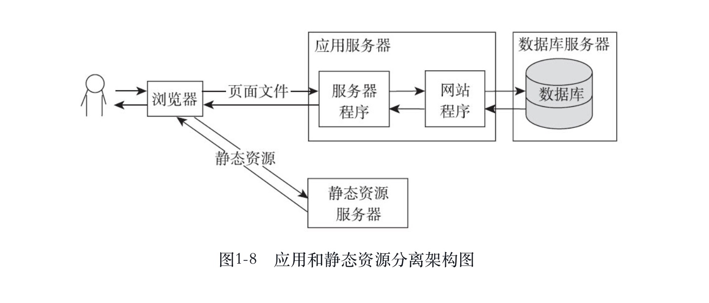
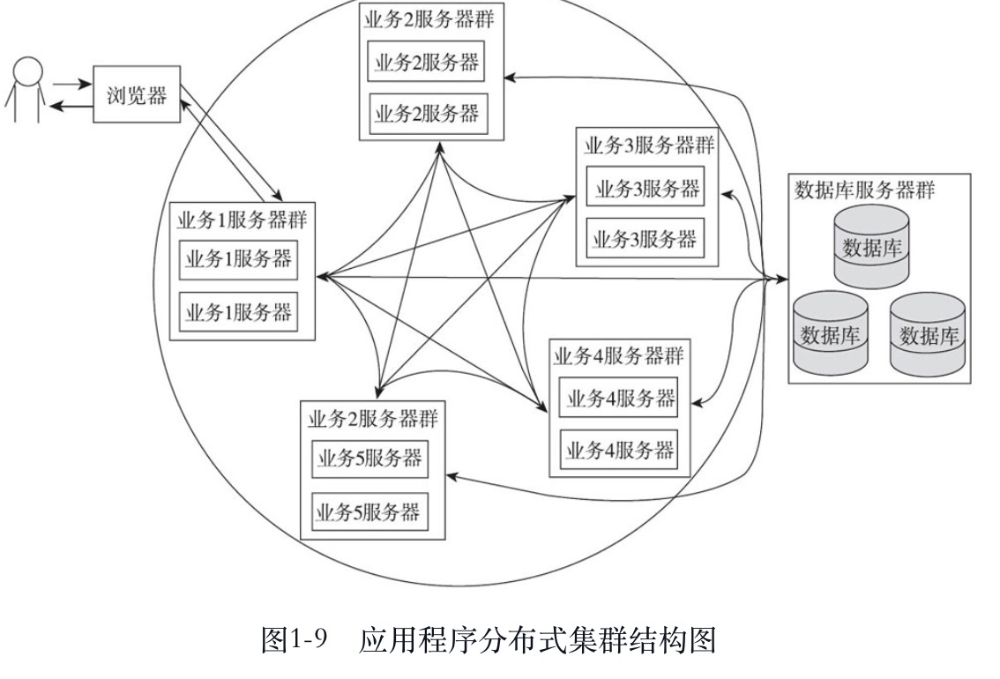

###应用和静态资源分离  
 &emsp;&emsp;刚开始的时候应用和静态资源是保存在一起的,
 当并发量达到一定程度时就需要将静态资源保存到专门的服务器,
 静态资源主要包括图片、js、css和一些资源文件,这些资源没有状态,
 所以分离比较简单,直接存放到专门的服务器就可以了。一般会使用专门的
 域名去访问。
 <!---->
 
 ###页面缓存
 &emsp;&emsp;页面缓存是将应用生成的缓存起来,这样就不需要每次都生成页面,
 从而节省大量cpu资源,如果将缓存中的页面放到内存中速度就更快了,
 可以使用nginx自带的缓存。
 
 ###集群和分布式
  &emsp;&emsp;集群和分布式都是使用多台服务器进行处理,
  集群:**是每台服务器都具有相同的功能,处理请求时调用那台服务器都可以,主要起分流作用**
  分布式:**是将不同的业务放到不同的服务器中,处理一个请求可能调用到多台服务器,
  这样就可以提高一个请求的处理速度**
  而且集群和分布式也可以一起使用。  
   &emsp;&emsp;集群有两种方式:一种是静态资源集群,一种是应用程序集群。静态集群比较简单,
  应用程序比较复杂,应用程序使用过程中会使用到一些缓存数据,如果集群就需要同步这些缓存数据
  其中最重要的是Session,Session同步也是应用程序集群非常核心的一个问题。  
  Session同步一般有两种处理方式:一种是session发生变化后自动同步到其他服务器,tomcat默认使用
  的这种方式。第二种可以使用专门的服务器安装memcached、redis等高效的缓存程序来统一管理session,
  然后在应用程序中通过重写Request并覆盖getSession方法来获取指定服务器中的session
  <!---->
  
  ###反向代理
   &emsp;&emsp;反向代理指的是客户端访问服务器并不提供真正的服务,它从别的服务器获取资源后将结果返回给用户。
   反向代理服务器可以和实际处理请求的服务器在同一台主机上，而且一台反向代理服务器也可以访问多台实际处理请求的服务器。  
   反向代理代理服务器主要有三个作用:  
    &emsp;&emsp;1、可以作为前端服务器跟实际请求服务集成  
    &emsp;&emsp;2、可以用作负载均衡  
    &emsp;&emsp;3、转发请求,比如可以将不同类型的资源请求转发到不同的服务器。
       
   
  